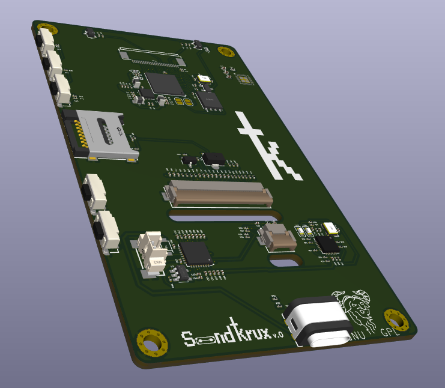

# SandKrux

Placa de desenvolvimento baseada no chip **K210**, com entradas para **touch**, **câmera** e **LCD grande**, criada especificamente para rodar o firmware **Krux**.

## Status do projeto
**Em desenvolvimento — não finalizado.**  
Este repositório está em evolução. Mudanças podem ocorrer sem aviso.

## Foto da placa
Coloque a imagem em `docs/placa.jpg` (ou ajuste o caminho abaixo).

## Firmware alvo
Este hardware está sendo desenvolvido para o firmware Krux:
- https://github.com/selfcustody/krux

## Como colaborar
Contribuições da comunidade são muito bem-vindas.  
Abra issues, discuta melhorias e proponha alterações.

## Licença
GPLv3.

## Nota sobre fabricação e apoio ao Krux
Se no futuro você pretender **fabricar e vender** este dispositivo, fica o pedido de doar **ao menos 1%** do valor dos dispositivos para a equipe de desenvolvimento do Krux.  
Este é um projeto open-source e, sem o trabalho deles, nada disso existiria.

## Agradecimentos
Obrigado à comunidade e à equipe do Krux pelo trabalho que torna este projeto possível.